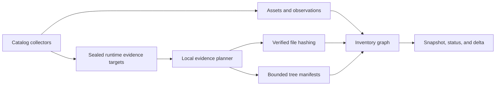

# SSC Init Local Content Evidence Core Design

**Date:** 2026-08-07  
**Status:** Approved by delegated product direction  
**Program:** Content Evidence, sub-project 1 of 2

## 1. Context

The inventory trust foundation can prove which catalog targets it inspected and
which logical assets and observations it discovered. It cannot prove whether a
plugin payload, skill instruction, IDE extension entry point, MCP declaration,
or project lockfile changed while its inventoried name and version stayed the
same.

This sub-project adds bounded, local content evidence. It does not decide
whether content is malicious. It produces deterministic evidence that later
behavioral analysis, threat intelligence, and policy layers can consume without
re-reading arbitrary user files or trusting mutable asset metadata.

The Content Evidence program is deliberately split into two independently
reviewable sub-projects:

1. **Local Content Evidence Core** — this specification: evidence contracts,
   descriptor-anchored hashing, bounded tree manifests, local evidence planning,
   caching, persistence, deltas, and coverage.
2. **External and Platform Evidence** — a later specification: immutable Docker
   identities, macOS code-signature validation, and package/executable
   provenance that requires commands, platform APIs, or ecosystem-specific
   location resolution.

The split keeps the default passive scan useful and verifiable before any new
external command or platform-specific verifier is introduced.

## 2. Goals

This sub-project must:

- detect content-only changes in supported local plugins, skills, IDE
  extensions, MCP configurations, and selected project manifests and lockfiles;
- attach evidence to the concrete observation where the content was found, not
  only to a deduplicated logical asset;
- distinguish a complete digest from partial, oversized, unavailable,
  unsupported, and skipped evidence;
- retain no source bytes, secret values, raw absolute paths, or arbitrary tree
  leaf names in reports or SQLite;
- keep all default evidence collection passive, offline, current-user-only,
  descriptor-anchored, and symlink-safe;
- make repeated scans efficient without accepting a weak cache hit as new
  content proof;
- preserve deterministic JSON, persistence, migration, and delta behavior;
- remain a CGO-free Go binary with no new mandatory runtime dependency.

## 3. Non-goals

This sub-project does not:

- label any asset safe, suspicious, or malicious;
- parse source code for dangerous APIs, obfuscation, or data flow;
- deobfuscate JavaScript, Python, JAR, WASM, or native code;
- inspect archive members or dependency graphs;
- query registries, marketplaces, Git hosting, TI feeds, or organization APIs;
- run Docker, package managers, `codesign`, `spctl`, or any other new command;
- validate publisher trust, release signatures, SBOMs, or build attestations;
- hash complete project source trees, personal directories, caches, mounted
  volumes, or unsupported catalog locations;
- add policy, warnings, blocking, quarantine, host adapters, or background
  monitoring.

`--external-probes` keeps its existing foundation behavior. This sub-project
does not broaden that flag.

## 4. Chosen approach

Evidence is a first-class inventory entity produced by a post-discovery local
evidence stage.

The rejected alternatives are:

- **Reuse `Asset.SHA256`:** one field cannot say which file or tree was hashed,
  which installation it came from, or why evidence was incomplete.
- **Build a content-addressed analysis store now:** retaining reusable blobs or
  complete per-file manifests would increase privacy, retention, migration, and
  cleanup scope before any analyzer needs those blobs.

The chosen evidence ledger preserves the meaning and coverage of each digest
while storing no content.



## 5. Evidence model

### 5.1 Content evidence

The public model adds `ContentEvidence`:

```go
type ContentEvidence struct {
    ID            string              `json:"id"`
    AssetID       string              `json:"assetId"`
    ObservationID string              `json:"observationId"`
    Kind          EvidenceKind        `json:"kind"`
    Subject       string              `json:"subject"`
    Status        EvidenceStatus      `json:"status"`
    Algorithm     string              `json:"algorithm,omitempty"`
    Digest        string              `json:"digest,omitempty"`
    Size          int64               `json:"size,omitempty"`
    Files         int                 `json:"files,omitempty"`
    Directories   int                 `json:"directories,omitempty"`
    Symlinks      int                 `json:"symlinks,omitempty"`
    Metadata      map[string]string   `json:"metadata,omitempty"`
    Errors        []EvidenceError     `json:"errors,omitempty"`
}
```

`EvidenceKind` values in this sub-project are:

- `file-sha256` — exact bytes of one regular file;
- `tree-sha256` — a domain-separated manifest of a bounded directory tree;
- `semantic-sha256` — a canonical, secret-free representation derived from an
  already parsed configuration;
- `package-content` — reserved for package artifact evidence and emitted only
  as `unsupported` in this sub-project;
- `container-identity` — reserved for immutable image evidence and emitted only
  as `unsupported` in this sub-project.

The two reserved kinds cannot carry an algorithm, digest, size, or count until
the External and Platform Evidence contract activates them in a later schema.

`EvidenceStatus` values are:

- `complete` — all bytes and entries required by the evidence contract were
  observed and the digest is eligible for content identity;
- `partial` — a deterministic digest of the observed subset may exist, but it
  is not eligible for immutable identity;
- `oversize` — a file, entry count, total-byte, depth, or time bound prevented
  complete hashing;
- `unavailable` — the target disappeared, changed identity, or could not be
  read;
- `unsupported` — a discovered form has no safe evidence implementation;
- `skipped` — evidence was intentionally not attempted under the active scope.

Only `complete` evidence may be treated as a content identity by later layers.
If `Status` is not `complete`, `Digest` is diagnostic evidence only and must
never be promoted to a trusted identity.

### 5.2 Identity

An evidence ID is stable across content changes. It is:

```text
evidence:sha256:<lowercase hex SHA-256>
```

The digest input is the length-prefixed canonical tuple:

```text
ssc-init.evidence.id.v1
observation ID
evidence kind
subject
```

Content digest, status, counts, metadata, and errors are not part of the ID.
A changed digest therefore produces `ChangeChanged`, while a moved observation
produces the existing observation removal/addition plus matching evidence
removal/addition.

### 5.3 Subject vocabulary

`Subject` is not a free-form path. The initial controlled vocabulary is:

- `manifest`;
- `skill-document`;
- `entrypoint-main`;
- `entrypoint-browser`;
- `payload-tree`;
- `mcp-declaration`;
- `package-content`;
- `container-image`;
- `project-manifest:<catalog-name>`;
- `project-lockfile:<catalog-name>`.

`<catalog-name>` is selected from the immutable project evidence catalog in
section 8.4. Collector-supplied arbitrary names are rejected.

### 5.4 Errors and metadata

`EvidenceError` contains only a stable code and fixed message. It has no path
field. Initial codes are:

- `identity_changed`;
- `symlink_rejected`;
- `special_file_rejected`;
- `file_limit`;
- `byte_limit`;
- `depth_limit`;
- `time_limit`;
- `path_invalid`;
- `read_unavailable`.

Metadata keys and values are schema-controlled. This sub-project permits only:

- `format`: `raw`, `ssc-init.tree.v1`, or `ssc-init.semantic-mcp.v1`;
- `cache`: `hit`, `miss`, `disabled`, or `rejected`;
- `entrypoint`: a catalog-sanitized relative entry point already accepted by
  the IDE manifest parser;
- `completeness`: `complete` or `observed-subset`.

No error or metadata value may contain a raw path, an unapproved tree leaf
name, source slice, token, environment value, endpoint credential, or command
output. The schema-controlled `entrypoint` value is the only relative payload
path retained by this sub-project.

## 6. Scan contract

### 6.1 Inventory and delta

`Inventory` adds a non-nil, deterministically ordered `Evidence` slice.
`ChangeEntity` adds `evidence`. Diffing canonical evidence excludes explicit
observation timestamps (evidence has no wall-clock field) and the `cache`
metadata key: cache provenance describes how a run obtained a digest, not what
the content is, so including it made every content change echo on the following
run. See `2026-08-08-hook-severity-ladder-design.md`, "Required upstream fix".

Evidence ordering is by `ID`. Error ordering is by code. Metadata is encoded by
Go's deterministic JSON map-key ordering, but validation rejects unknown keys so
metadata cannot become an unbounded side channel.

### 6.2 Evidence coverage

`ScanResult` adds one `EvidenceCoverage` object:

```go
type EvidenceCoverage struct {
    Status   CoverageStatus          `json:"status"`
    Targets  []EvidenceTargetResult  `json:"targets"`
    Errors   []CoverageError         `json:"errors,omitempty"`
}
```

Each target result has the exact public contract:

```go
type EvidenceTargetResult struct {
    TargetID      string            `json:"targetId"`
    AssetID       string            `json:"assetId"`
    ObservationID string            `json:"observationId"`
    EvidenceID    string            `json:"evidenceId"`
    Status        EvidenceStatus    `json:"status"`
    Errors        []EvidenceError   `json:"errors,omitempty"`
}
```

`TargetID` comes from the immutable collector evidence catalog. It is not a
path. `EvidenceID` is present whenever the target's asset, observation, kind,
and subject passed identity validation, including non-complete evidence.
Target results are ordered by `TargetID`, `ObservationID`, and `EvidenceID`.

Every sealed runtime evidence target produces exactly one target result, even
when its evidence is unavailable or unsupported. A required local target with
`partial`, `oversize`, `unavailable`, or `unsupported` evidence prevents the
overall evidence coverage from being complete. Existing discovery coverage is
not rewritten: discovery can be complete while content evidence is partial.

The overall scan is `partial` if discovery or required evidence coverage is not
complete. The report must not use the phrase “full scan” when evidence coverage
is absent or incomplete.

### 6.3 Runtime-only targets

Collectors may emit `LocalEvidenceTarget` values in `CollectorResult` with
`json:"-"`. A target contains raw host paths only during the scan:

```go
type LocalEvidenceTarget struct {
    TargetID      string
    AssetID       string
    ObservationID string
    Kind          EvidenceKind
    Subject       string
    PresetStatus  EvidenceStatus
    RootPath      string
    RelativePath  string
    Provenance    any
}
```

For file and tree kinds, `RootPath` is the collector's verified catalog or
configured project root and `RelativePath` is the path below that root. For a
semantic kind, both path fields are empty and the engine canonicalizes the
referenced normalized observation; collectors do not hand arbitrary semantic
bytes to the engine.

`PresetStatus` is empty for attempted local evidence. It may be
`unsupported` or `skipped` only when the immutable catalog requires a visible
terminal record but deliberately supplies no path. Preset targets cannot carry
paths, anchor data, or a digest. Other preset values are rejected.

Targets pass issuance and graph binding only when:

- they were sealed by the collector instance that created the associated asset
  and observation;
- asset, observation, target, kind, subject, and path components match the
  seal;
- the referenced observation survived graph normalization and belongs to the
  referenced asset;
- semantic evidence carries no filesystem path and is derived only from the
  schema-controlled fields of the referenced observation.

After issuance and graph binding pass, file and tree paths are validated before
any open. A sealed target with a non-canonical, empty, dot, parent, absolute,
separator-bearing, or NUL-bearing component produces an evidence record with
`unavailable/path_invalid` and zero filesystem access. A valid relative target
must remain below the collector's verified catalog or configured project root.

The private provenance proof also seals the discovery-time identity of the
catalog root and observed asset directory. When asset identity came from a
manifest or skill document, the proof seals that anchor's SHA-256, size, mode,
and file identity as observed by the collector's already verified read. The
proof is runtime-only and contains no source bytes.

The evidence stage reopens and compares the sealed root and asset-directory
identity before reading. It verifies the identity anchor before and after file,
entry-point, or tree evidence collection. If an anchor changed, the associated
evidence is `unavailable` with `identity_changed`; the engine never combines an
asset identity parsed from one revision with content evidence from another.
Collectors compute an anchor SHA-256 while processing bytes they already read;
this does not introduce a second path read or a public evidence record before
graph normalization.

Forged or altered seals, absent graph references, and asset/observation mismatch
become fixed `target_rejected` coverage errors and produce no evidence record.
Raw targets are cleared before report generation or persistence and are
prohibited by persistence validation.

The baseline pipeline order is fixed:

1. collect and target-contract-normalize discovery results;
2. perform the existing sealed project-MCP follow-up;
3. build and normalize assets, observations, and relationships;
4. validate runtime evidence targets against the normalized graph;
5. collect local evidence and append it to the inventory;
6. clear all runtime targets and provenance;
7. compute the evidence-aware delta and atomically persist the snapshot;
8. update the best-effort content cache after the snapshot commit.

Evidence therefore cannot preserve an asset or observation that graph
normalization rejected.

## 7. Verified hashing

### 7.1 File hashing

File evidence reuses and strengthens the existing descriptor-anchored path:

1. open the catalog root with `RootedFileSystem.OpenRoot`;
2. open each directory component with `OpenVerifiedRoot`;
3. reject a symbolic link or non-regular final component;
4. open the file with no-follow semantics;
5. compare the pre-open, opened, post-read, and path-after identities;
6. stream at most the applicable byte limit through SHA-256;
7. require bytes read to equal the stable opened size;
8. return lowercase 64-character SHA-256 only on complete reads.

The public `HashFile(path)` convenience remains for existing callers, but the
evidence engine operates from an already opened verified root and relative
components. After the evidence engine reopens and verifies the sealed catalog
root once, it must not reconstruct an absolute target path and reopen it.

### 7.2 Bounded tree manifest

Tree evidence uses `ssc-init.tree.v1`. Traversal is descriptor-anchored,
depth-first, and lexically sorted by the exact entry-name bytes returned by the
filesystem. It never follows a symbolic link.

`RootedDirectory` gains one no-follow `Readlink(name)` operation so the engine
can hash link-target bytes without resolving them. The OS implementation uses
the already opened root; test filesystems must implement the same boundary.

The domain-separated manifest contains length-prefixed records:

```text
header: ssc-init.tree.v1
directory: relative-path, permission bits
file: relative-path, permission bits, byte size, SHA-256 bytes
symlink: relative-path, SHA-256 of link-target bytes
special: relative-path, file-type bits
```

The persisted evidence contains only the final manifest digest and aggregate
counts. Relative paths, leaf digests, link targets, and individual filenames are
not retained.

A symlink or special file is represented in the observed-subset digest and
makes status `partial`; it is never followed. A read or identity error also
makes status `partial`. Hitting a numeric bound makes status `oversize`.

The initial per-tree limits are:

- depth: 32 directory levels below the target root;
- entries: 4,096 files, directories, links, and special entries;
- one regular file: 64 MiB;
- total regular-file bytes: 256 MiB;
- recorded errors: 64;
- elapsed time: a separate 30-second evidence-target deadline bounded by the
  overall scan context.

These are security bounds, not tuning defaults. A later schema version may
change them; `ssc-init.tree.v1` never changes meaning.

### 7.3 Semantic MCP evidence

Raw MCP configuration files may contain credentials. SSC Init therefore does
not persist or expose their raw-file digest.

For each successfully parsed MCP observation, the existing parser produces a
canonical secret-free structure containing only:

- normalized transport kind;
- normalized command basename or sanitized endpoint identity;
- normalized arguments after existing privacy validation;
- sorted environment-variable names, never values;
- enabled/disabled state and schema-controlled host identity.

The structure is encoded with `ssc-init.semantic-mcp.v1` field order and hashed
with SHA-256. Unknown fields and secret values do not enter the digest. A raw
file change that does not alter the supported semantic structure intentionally
does not produce an MCP content change.

Malformed sibling entries retain the existing partial discovery behavior. Each
valid sibling still receives semantic evidence; no digest is emitted for an
entry that did not produce an observation.

## 8. Evidence scope

### 8.1 Agent plugins

For each supported Claude or Codex plugin observation:

- hash the recognized plugin manifest as `manifest` when present;
- hash the complete bounded plugin directory as `payload-tree`.

Cursor plugin roots remain unsupported because the foundation catalog does not
yet implement them. The evidence catalog must expose that state rather than
claiming the plugin was checked.

### 8.2 Agent skills

For each supported Claude, Codex, or Cursor skill observation:

- hash `SKILL.md` as `skill-document`;
- hash the complete bounded skill directory as `payload-tree`.

The skill document digest changes for any instruction-body change, even when
frontmatter identity stays unchanged.

### 8.3 IDE extensions

For supported VS Code, VS Code Insiders, VS Code OSS, Cursor, and Windsurf
extension observations:

- hash `package.json` as `manifest`;
- validate the already parsed `main` and `browser` values as relative paths
  beneath the extension root and hash each declared regular file under its
  controlled subject;
- hash the complete bounded extension directory as `payload-tree`.

An absolute, parent-traversing, NUL-containing, symlinked, missing, or
non-regular entry point produces non-complete evidence and is never opened
outside the extension root.

For supported JetBrains plugin observations:

- hash `META-INF/plugin.xml` as `manifest`;
- hash the complete bounded plugin directory as `payload-tree`.

The tree includes JAR bytes but does not enumerate or analyze archive members.

### 8.4 Project evidence catalog

Project evidence is limited to already configured project roots and the same
bounded, excluded-directory walk used by project MCP discovery. It adds an
immutable filename catalog:

| Ecosystem | Manifests | Lockfiles |
|---|---|---|
| npm-compatible | `package.json` | `package-lock.json`, `npm-shrinkwrap.json`, `pnpm-lock.yaml`, `yarn.lock`, `bun.lock`, `bun.lockb` |
| Python | `pyproject.toml`, `Pipfile`, `requirements.txt` | `poetry.lock`, `Pipfile.lock`, `uv.lock` |
| Go | `go.mod` | `go.sum` |
| Cargo | `Cargo.toml` | `Cargo.lock` |
| Homebrew | `Brewfile` | none |

Only exact catalog basenames are recognized. Wildcards such as
`requirements-*.txt` are excluded from this version to keep the persisted
subject vocabulary closed.

Each discovered project receives one existing project asset and observation.
Each recognized file receives one file evidence record attached to that
project observation. Project source trees, vendored dependencies, build output,
`.git`, and package caches remain excluded.

The project observation uses the existing opaque project ID as its asset ID,
the safe project location reference as `LocationRef`, collector `projects`, and
scope `project`. It is finalized through the same observation identity contract
as every other occurrence. Project-MCP configuration observations keep their
existing IDs and `ProjectID` links.

The walk retains foundation bounds: 12 levels, 100,000 entries, and 4,096
recognized configuration files per configured root. Each project evidence file
is capped at 32 MiB. A limit or hostile sibling makes only the affected target
partial and preserves unrelated evidence.

### 8.5 Packages and executables

Existing executable SHA-256 values produced by explicitly enabled package
probes remain asset evidence from the foundation but are not silently converted
to the new content-evidence contract.

The npm collector may know package installation paths, but package payload
hashing is deferred with all other package ecosystems so the second sub-project
can define one provenance contract instead of giving npm a misleadingly
stronger claim. Every discovered package therefore reports package-content
evidence as `unsupported` in this sub-project.

Docker tag assets likewise receive `unsupported` immutable-image evidence until
the External and Platform Evidence specification is implemented.

## 9. Cache

### 9.1 Purpose and trust boundary

The cache is an optimization for unchanged local files, not an authority. A
cache record is usable only on Darwin local filesystems when the scanner can
obtain a complete identity fingerprint containing:

- device and inode;
- file type and permission mode;
- byte size;
- modification time with nanoseconds;
- change time with nanoseconds;
- evidence algorithm and format version.

If locality or change time is unavailable, the engine rehashes and records
`cache=disabled`. Network, FUSE, union, and other non-local filesystems are
never cache-eligible.

### 9.2 Cache keys and validation

The cache stores no raw path. Its lookup key is SHA-256 over:

```text
ssc-init.content-cache.v1
observation ID
evidence kind
subject
SHA-256 of the runtime relative path
file identity fingerprint
```

The engine establishes the fingerprint before lookup and repeats the identity
check immediately after a hit. Any mismatch rejects the hit and hashes the
opened descriptor. A cache hit can supply only a previously complete file
digest produced by the same algorithm and format version.

Tree roots are always recomputed. Eligible unchanged leaves may reuse complete
file digests; directory enumeration, entry types, names, modes, sizes, and tree
manifest construction are never skipped.

Cache corruption, duplicate keys, malformed digests, future formats, or
identity mismatch cause a miss or rejection, never scan failure or trusted
evidence. Cache rows are written in a separate best-effort transaction only
after the corresponding snapshot has committed. Failure rolls back only that
cache transaction; the valid snapshot remains available.

Cache retention is bounded independently from immutable snapshots. A successful
cache transaction removes rows not used for 90 days, then removes the oldest
rows until at most 250,000 remain. Tests use reduced injected limits; production
limits are not CLI-configurable in this schema. Pruning uses only cache
timestamps and opaque keys.

## 10. Persistence and compatibility

The database adds migration 5 with:

- `evidence` rows keyed by `(scan_id, evidence_id)`;
- `evidence_state` for deterministic index and nil-shape preservation;
- `evidence_coverage` with exactly one validated v3 coverage object per v3
  scan;
- evidence count and nil state in `inventory_state`;
- `content_cache` keyed by its opaque cache key.

Foreign keys bind evidence to its scan, asset, and observation. Save order is
assets, observations, evidence, relationships, coverage, inventory errors, and
inventory state. Any evidence write failure rolls back the snapshot. Cache
writes occur only after that transaction commits and cannot roll it back.

The scan contract becomes `ssc-init.scan.v3`; status becomes
`ssc-init.status.v3`. The store must continue to read v1 and v2 snapshots.
Legacy snapshots load with a nil evidence slice and explicit
`legacyInventory=true`; they never imply complete evidence coverage.

Persistence validation rejects:

- missing or duplicate evidence IDs;
- references to absent assets or observations;
- an observation whose `AssetID` does not match the evidence `AssetID`;
- invalid kind, subject, status, algorithm, digest, count, error, or metadata;
- complete evidence without a valid lowercase SHA-256 digest;
- unsupported or skipped evidence carrying a digest;
- raw absolute paths, home markers, credential-shaped values, percent-encoded
  path masking, or forbidden metadata in any evidence field;
- any surviving runtime target or provenance object.

## 11. Failure behavior

Evidence failures are isolated to the smallest target:

- one hostile plugin does not prevent unrelated plugin or project evidence;
- one unreadable entry makes its tree evidence partial but preserves its
  observed-subset digest and aggregate counts;
- one oversized lockfile produces `oversize` for that file only;
- cancellation or deadline stops remaining evidence targets and records them as
  unavailable or skipped without inventing digests;
- a forged runtime target is rejected before path access;
- a cache failure falls back to hashing;
- persistence validation failure rolls back the new snapshot and keeps the
  previous snapshot readable.

User-facing errors remain fixed strings. Raw OS errors are wrapped for internal
control flow but are never copied into reports or SQLite.

## 12. Performance and concurrency

Evidence targets are processed in deterministic target order with at most four
concurrent targets. Within one tree, traversal and manifest assembly are
sequential so byte and entry bounds are exact and output is deterministic.

The evidence stage shares the scan context. Each target receives its own
30-second evidence deadline, bounded by any shorter remaining scan deadline. An
initial scan continues to target the broader ten-minute product budget. A
cache-warm scan continues to target the broader 60-second incremental budget;
exceeding either budget yields explicit partial coverage rather than silent
omission.

Hash buffers are fixed-size and reused. Source files and complete leaf manifests
are not accumulated in memory. The store retains only evidence summaries and
cache rows.

## 13. Security invariants

The following are release-blocking invariants:

1. no evidence read follows a symbolic link;
2. no evidence target escapes its verified collector root;
3. no absolute target path is reconstructed or reopened after the evidence
   engine verifies its sealed root;
4. discovery identity anchors match before and after evidence collection;
5. file identity is stable across open and read;
6. only complete evidence is eligible for content identity;
7. a cache hit requires local-filesystem and change-time proof;
8. no raw content, leaf name list, link target, secret, or absolute path is
   persisted or reported;
9. every accepted runtime target has exactly one coverage result;
10. evidence for one observation cannot be reassigned to another asset;
11. deterministic input produces byte-identical report JSON and snapshot state;
12. default evidence collection executes no command and performs no network
    access;
13. non-Darwin operational commands fail before state creation.

## 14. Verification strategy

### 14.1 Model and identity

- stable evidence ID across content changes;
- unique IDs across observations, kinds, and subjects;
- deterministic ordering and nil/empty behavior;
- evidence-aware added, removed, and changed deltas;
- rejection of invalid status/digest combinations and free-form subjects.

### 14.2 Filesystem adversarial tests

- regular file hashing at zero, exact-limit, and limit-plus-one sizes;
- symlinked root, intermediate directory, final file, and link swap races;
- discovery anchor replacement before evidence and mutation during evidence;
- inode replacement, truncate, append, mode, mtime, and ctime changes;
- FIFO, socket, device, sparse, unreadable, and disappearing entries;
- hostile names, invalid UTF-8, decomposed Unicode, deep trees, and excessive
  entries;
- cancellation before open, during read, and between tree entries;
- tree digest stability across directory enumeration order;
- no real-home or sibling marker reads.

### 14.3 Collector matrix

- Claude and Codex plugin manifest plus payload-tree changes;
- Claude, Codex, and Cursor `SKILL.md` body-only changes;
- all supported VS Code-family manifests, `main`, `browser`, and payload trees;
- entry-point traversal, absolute path, symlink, missing file, and identity swap;
- JetBrains `plugin.xml` and JAR-byte changes;
- secret-only and supported-semantic MCP changes;
- every project manifest and lockfile catalog name;
- excluded directory, project-root, depth, entry, config, and byte limits;
- explicit unsupported package and Docker evidence.

### 14.4 Cache

- miss, valid hit, malformed row, duplicate/corrupt row, future format, and
  transaction rollback;
- size-preserving and mtime-preserving content replacement rejected through
  ctime or inode change;
- cache disabled when local-filesystem or change-time evidence is unavailable;
- tree root changes for add, remove, rename, mode, symlink-target, and leaf-byte
  changes even when other leaves hit cache.

### 14.5 Persistence and end to end

- migration 4 to 5 and fresh migration 5 schema verification;
- v1, v2, and v3 snapshot read compatibility;
- evidence, coverage, error, count, order, and nil-shape round trips;
- snapshot rollback on evidence write failure and snapshot preservation on a
  separately rolled-back cache write failure;
- corrupt references, JSON, digests, subjects, metadata, and path masking;
- isolated-home baseline, status reopen, second scan, and evidence delta;
- no network, Docker daemon, package manager, `codesign`, or real-home contact;
- Darwin arm64 native and amd64 Rosetta release smoke;
- fresh race, vet, module verification, diff check, checksum, and clean-worktree
  gates.

## 15. Acceptance criteria

This sub-project is complete only when:

1. a content-only mutation of every supported plugin, skill, IDE, MCP, and
   project evidence fixture produces the expected deterministic evidence delta;
2. every runtime evidence target produces one visible terminal status;
3. only complete evidence contains a trusted SHA-256 identity;
4. tree traversal remains descriptor-anchored and never follows symlinks;
5. discovery-time identity anchors prevent old asset identity from being paired
   with evidence collected from a changed revision;
6. hostile, oversized, missing, or changing content cannot abort unrelated
   evidence or overwrite the previous snapshot;
7. cache hits require the full local identity contract and all cache failures
   safely fall back to hashing;
8. reports and SQLite contain no raw content, secret value, arbitrary leaf list,
   link target, real home path, or external absolute path;
9. project evidence is limited to the immutable filename catalog and configured
   roots;
10. default scans execute no new process and contact no network or daemon;
11. scan v3 and status v3 are deterministic and v1/v2 snapshots remain
    readable without implying evidence coverage;
12. README language states exactly which content is hashed and continues to
    disclaim malware verdicts and safety guarantees;
13. fresh race, vet, module, migration, isolated-home, Darwin build, checksum,
    native/Rosetta smoke, and independent review gates pass on a clean worktree.

## 16. Next specification

After this sub-project passes all acceptance criteria, the next design covers
External and Platform Evidence:

- local Docker context proof, image ID, RepoDigest, and mutable-tag state;
- macOS static code-signature validation with all-architecture handling and
  race-resistant before/after content identity;
- artifact location and provenance for npm, Python/pipx/uv, Cargo, Go, and
  Homebrew installations;
- executable-to-artifact linkage and registry-integrity fields;
- explicit unsupported and remote-context behavior.

Threat intelligence, behavioral verdicts, policy, warnings, blocking, and host
adapters remain later programs.
